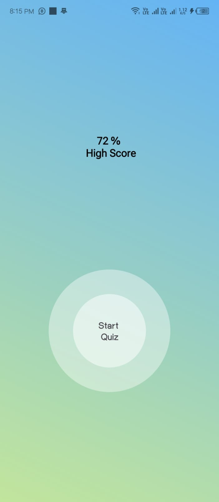
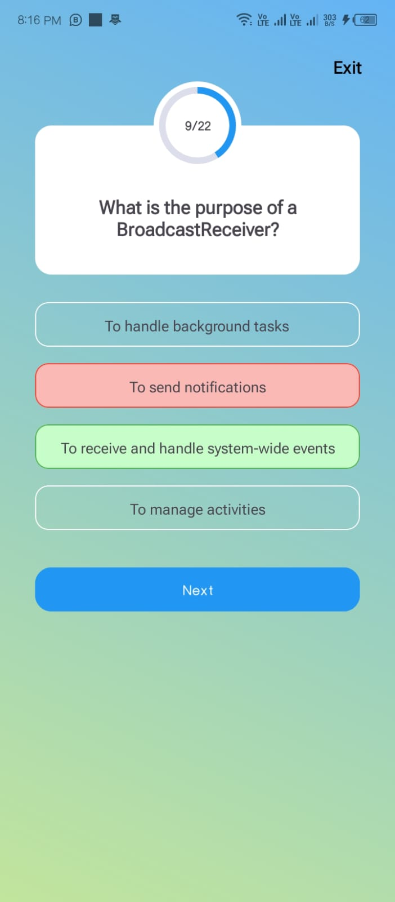

# Quizly

## Overview

The **Quizly** is an interactive quiz application built using Kotlin for Android. It follows the **MVVM (Model-View-ViewModel)** architecture to ensure a clean separation of concerns and ease of maintenance. The app dynamically loads quiz questions from a Room Database, allowing users to take a quiz, track their score, and view real-time feedback after each question.

The app uses `LiveData` and `ViewModel` to handle UI-related data in a lifecycle-conscious way, ensuring that the user experience is smooth and responsive.

---

## Features

- **Dynamic Quiz Questions**: Quiz questions are fetched from a Room Database, providing flexibility to modify or add new questions without changing the app code.
- **Score Tracking**: The app tracks correct and incorrect answers, updating the score as the user progresses.
- **Real-Time Quiz Progress**: A circular progress bar visually displays the user's progress through the quiz.
- **Answer Feedback**: The app highlights the selected option with color codes (green for correct, red for incorrect) and shows the correct answer after each question.
- **Question Navigation**: Users can move to the next question once they’ve selected an answer. The app shows the current question number and the total number of questions.
- **MVVM Architecture**: The app is structured using the MVVM architecture to keep the UI code clean and maintainable.
- **Interactive UI**: Material Design components like cards are used for displaying options, ensuring a modern and user-friendly interface.
- **Live Data Updates**: The app uses `LiveData` to observe changes in the question index, score, and quiz progress.

---

## Technologies Used

- **Kotlin**: The primary language used for app development.
- **MVVM Architecture**: Helps in maintaining a clear separation between the UI and business logic.
- **Room Database**: Used for storing quiz questions and their options locally on the device.
- **LiveData**: Ensures that the UI updates automatically in response to changes in data.
- **ViewModel**: Manages UI-related data in a lifecycle-conscious way.
- **Material Design**: Provides a modern and consistent design for the UI components.
- **Circular Progress Bar**: Displays real-time quiz progress.
- **Android Jetpack Libraries**: For improved app structure, navigation, and background processing.

---

## Screenshots

### Home Screen
- Displays quiz instructions and options to start the quiz.
  


### Quiz Screen
- Shows the current question with four answer options. The user selects one of the options to proceed.
  


### Result Screen
- Displays the user's score with feedback on how they performed in the quiz.


---

## How It Works

### **1. Quiz Data Loading**
The app fetches quiz questions from a local Room Database. The `QuizViewModel` uses a `QuizRepository` to load data from the database into the `LiveData` object (`_quizList`). This data is then observed by the UI and presented to the user.

### **2. Answer Selection**
When the user selects an answer, the app compares it to the correct answer stored in the quiz data. The answer is highlighted (green for correct, red for incorrect), and the score is updated.

### **3. Progress Tracking**
A circular progress bar at the top of the screen shows the user's progress as they move through the quiz. The progress is updated each time the user answers a question.

### **4. Result Calculation**
Once all questions have been answered, the app navigates to a results screen, showing the total number of correct and incorrect answers.

---

1. **Clone the Repository**
   ```bash
   git clone https://github.com/Jawad-Hameed-00/Quizly
